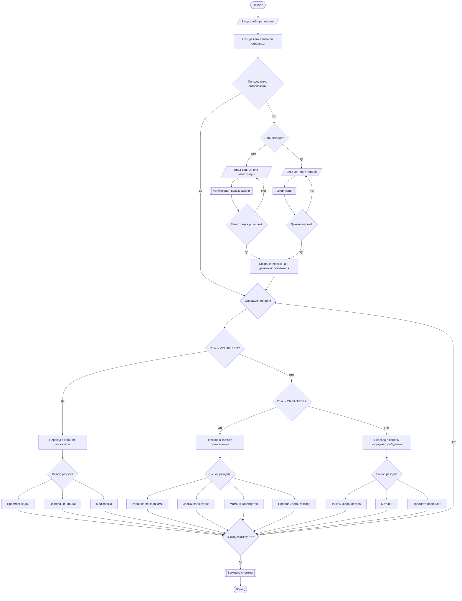
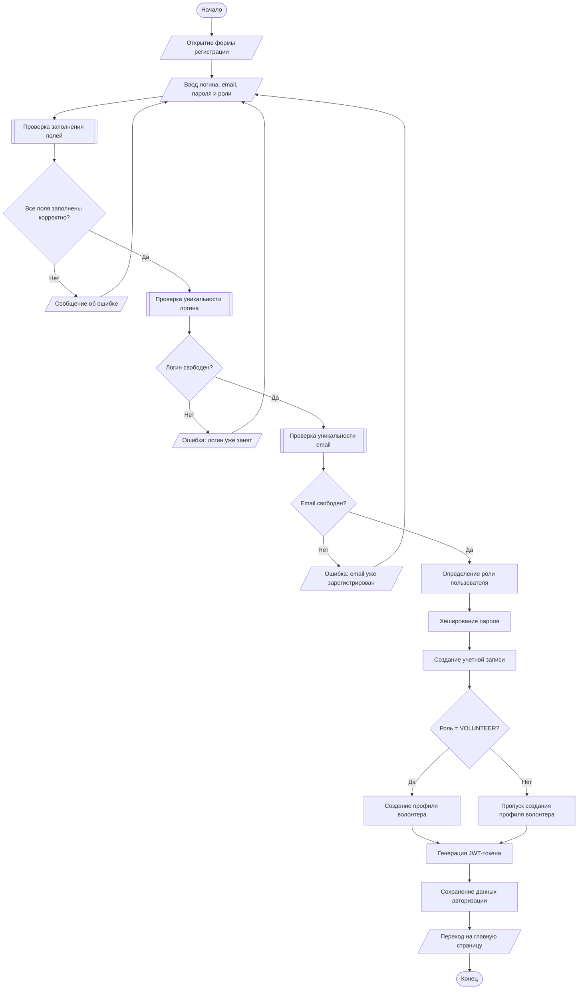
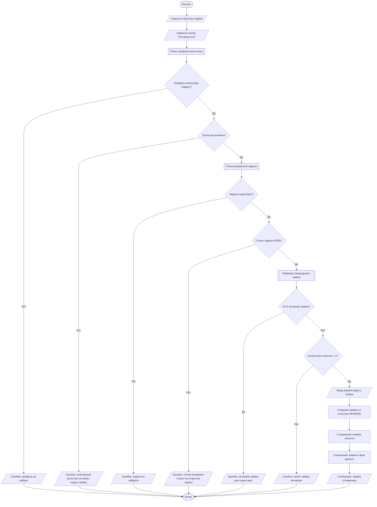

# Блок-схемы программы

Ниже приведены 3 блок-схемы, оформленные стандартными типами блоков:

- `([Текст])` — начало/конец.
- `[/Текст/]` — ввод/вывод.
- `[Текст]` — процесс.
- `[[Текст]]` — предопределенный процесс.
- `{Текст?}` — проверка условия.
- `((N))` — соединитель.

## 1. Блок-схема работы программы

## 2. Блок-схема процесса регистрации пользователя

## 3. Блок-схема процесса подачи заявки на задачу

